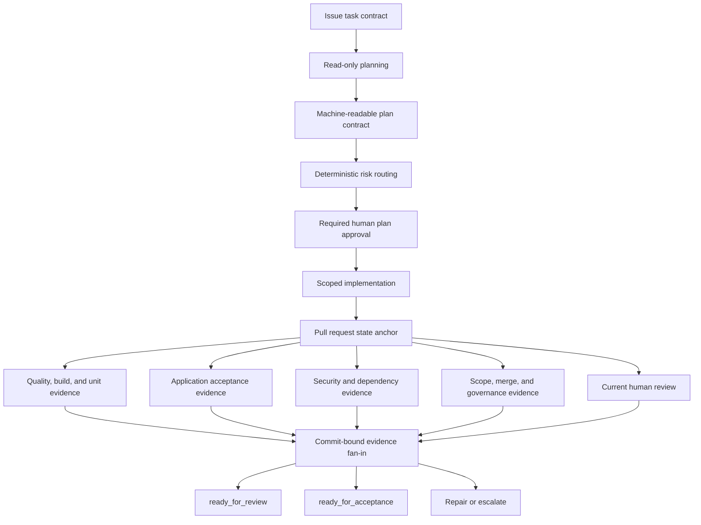

# Architecture

## System model

The AI engineering system coordinates people, agents, repositories, tools, and
platform policy around one control loop:

```text
task contract -> plan -> approval -> act -> evaluate -> accept or repair
      ^                                                   |
      +---------------- external memory ------------------+
```

Its responsibility boundary is:

> Agents propose; humans and policy accept.

The system is not an autonomous developer. It is a governed delivery system in
which agent capabilities are explicit, evidence is machine-verifiable, and
acceptance remains independent from implementation.

## Architecture layers



### Contract layer

The task contract is the source of authority. It includes:

- goal and authoritative sources;
- allowed and prohibited scope;
- constraints and non-goals;
- required outputs;
- observable success criteria;
- validation and rollout expectations;
- stop conditions.

The contract is fetched from a trusted live issue and digested. Fixtures may
exercise parsers and demos but cannot authorize real writes.

### Planning layer

Planning is read-only. The plan contract binds:

- task identity and task-contract digest;
- base branch and full base SHA;
- allowed and prohibited paths;
- risk level and risk reasons;
- ordered steps and success-criterion mappings;
- required checks and evidence;
- decisions, handoffs, rollback, and escalation.

High and critical plans require approval of the plan-only commit. The approval
record binds the contract digest, plan digest, base SHA, plan commit, reviewer,
review ID, and timestamp.

### Capability layer

Each role receives only the tools needed for its phase:

- planner: read and search;
- implementer: scoped edits and allowlisted validation;
- dependency agent: dependency manifests and lockfiles;
- security reviewer: read-only security analysis;
- risk reviewer: read-only diff and evidence review.

Native lifecycle hooks provide pre-action defense in depth. Commit-level scope
checks then evaluate the complete diff, including renames. Workflow permissions,
protected environments, GitHub Apps, and repository rules independently
constrain hosted actions.

### Evaluation layer

Evaluation fans independent checks out and evidence back in:

1. task and plan contract validity;
2. plan approval;
3. changed-path scope;
4. instruction synchronization, lint, typecheck, build, and unit tests;
5. application acceptance tests;
6. dependency audit;
7. secret scanning and CodeQL;
8. merge compatibility;
9. governance policy;
10. current human review.

Each producer emits a commit-bound evidence envelope. The execution report
rejects missing, failed, skipped, duplicate, stale, cross-run, or cross-commit
evidence.

### Acceptance layer

`ready_for_review` means the local reference evidence is complete.
`ready_for_acceptance` additionally requires live hosted evidence:

- the current immutable head commit;
- required workflow checks;
- current human approval;
- CODEOWNERS and branch/ruleset enforcement;
- required protected-environment approvals;
- the stable trusted-publisher status.

Repository configuration files can describe these controls but cannot prove
they are enabled.

### Recovery layer

Failures are classified as reasoning error, tool misuse, context issue,
conflict, policy failure, security failure, transient environment failure, or
unknown. Automated repair stops on repeated signatures, policy/security
failures, unknown failures, or an exhausted attempt budget.

## GitHub as external memory

| Artifact | Durable responsibility |
| --- | --- |
| Issue | Requirements, authority, scope, and success criteria |
| Plan pull request | Plan, risk, decisions, handoffs, and rollback |
| Implementation branch and commits | Isolated action history |
| Implementation pull request | State anchor for code and evidence |
| Workflow runs and artifacts | Objective evaluation |
| Reviews | Human plan and implementation decisions |
| Environment events | Critical authorization |

Agents reload this state on resume. Conversation history and hidden reasoning
are not authoritative.

## Technology mapping

The reference implementation uses:

- GitHub Issues, branches, pull requests, reviews, CODEOWNERS, rulesets, and
  protected environments;
- GitHub Copilot custom agents, repository instructions, prompt files, and
  native lifecycle hooks;
- GitHub Actions for deterministic fan-out/fan-in evaluation;
- CodeQL, dependency audit, and supplemental secret scanning;
- GitHub Agentic Workflows for bounded Continuous AI;
- GitHub MCP controls for registry and named-tool governance;
- GitHub Apps with environment-scoped private keys for trusted publication and
  maintenance dispatch;
- PostgreSQL to prove multi-instance application behavior.

Equivalent technologies are acceptable only when they preserve the same
contracts, capability boundaries, evidence, and acceptance semantics.

## Self-modifying control plane

Validation code cannot safely approve a change to itself. A control-plane
change therefore follows two boundaries:

1. the pull-request-controlled workflow records
   `validation-authority: fail`;
2. a default-branch workflow, protected environment, independent human
   reviewer, and separately scoped trusted identity revalidate the immutable
   commit before publishing acceptance.

The first installation of that mechanism is an explicit audited bootstrap. It
does not create a reusable bypass.

The specification repository avoids this circularity entirely: it has no
active copy of the controls. Changes are proved in Northstar and only then
documented here.

## Continuous AI

Continuous AI is bounded automation, not unattended authority. The reference
agentic workflow:

- runs from a Markdown source definition;
- has read-only repository access;
- has a bounded AI-credit budget;
- enables only named tools;
- permits only a staged, bounded safe output;
- remains subordinate to deterministic CI and human acceptance.

## MCP boundary

MCP servers are external capabilities. Administrators must:

- approve servers through an organization or enterprise registry;
- enable named tools rather than wildcards;
- supply credentials only through protected runtime variables;
- treat new servers or expanded tools as high-risk dependency and policy
  changes;
- verify hosted settings separately from repository configuration.
